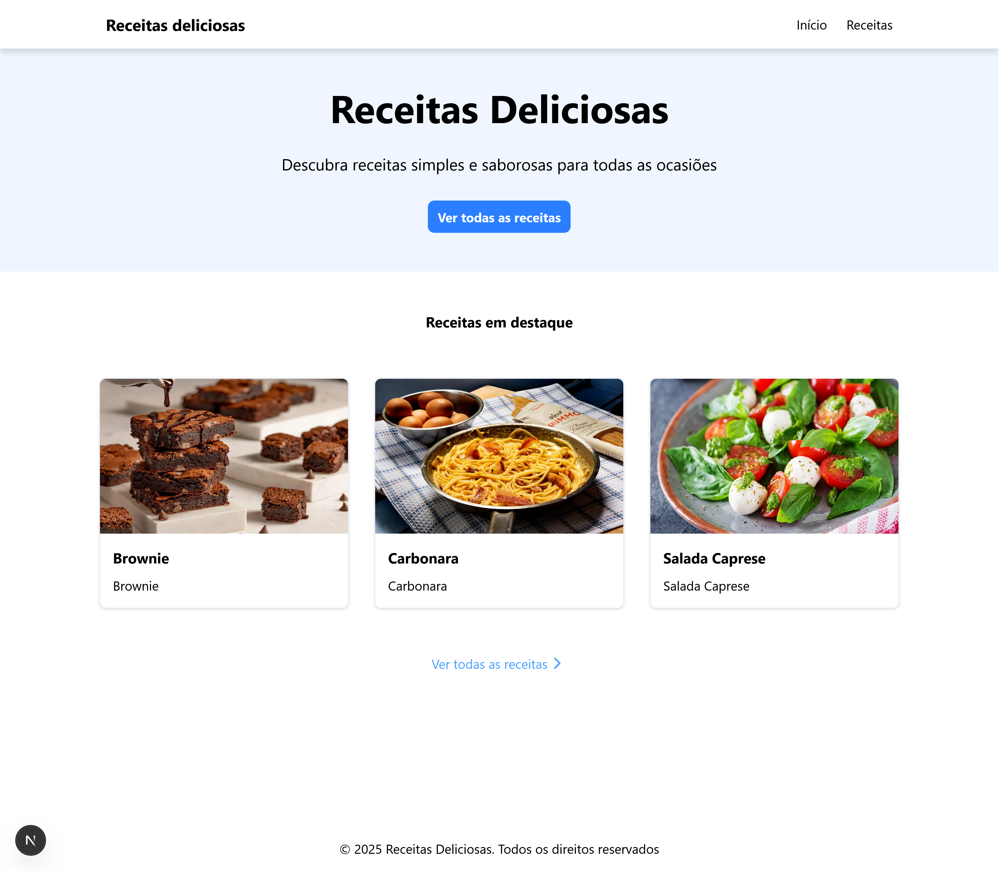

## Sobre

Site de receitas feito para o primeiro projeto usando Next.js;
Desenvolvido durante as aulas de web que fazem parte do trainee da empresa júnior byron.solutions

## Preview



## Estrutura

Na primeira versão, o site tem uma home page que mostra os cards das receitas em destaque, que redirecionam o usuário para as instruções e informações dela. Também existe uma página com os cards de todas as receitas.

## Como executar

Primeiro, execute o servidor de desenvolvimento:

```bash
npm run dev
# ou
yarn dev
# ou
pnpm dev
# ou
bun dev
```

Abra [http://localhost:3000](http://localhost:3000) com seu navegador para ver o site resultante.
