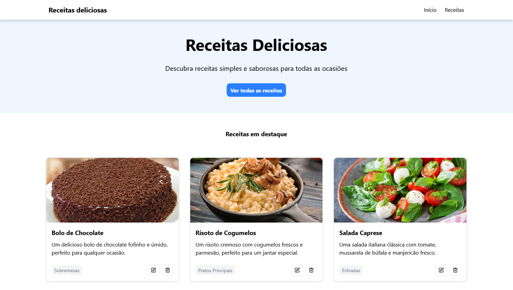

## Sobre

Esse projeto é um site de gerenciamento e visualização de receitas, desenvolvido durante as aulas de Next.Js que fazem parte do trainee da empresa júnior byron.solutions

## Preview



## Estrutura / Funcionalidades
- Uma página de boas-vindas que destaca algumas receitas populares e convida o usuário a explorar todas as opções 
- Uma seção dedicada onde todas as receitas cadastradas são exibidas em um formato de grade
- Ao clicar em uma receita, o usuário pode visualizar informações detalhadas como título, categoria, ingredientes e instruções de preparo
- O usuário pode cadastar, editar e excluir receitas
- A API utilizada para esse projeto está disponìvel em https://github.com/talles-morais/receitas-byron-backend

## Como executar

Primeiro, execute o servidor de desenvolvimento:

```bash
npm run dev
# ou
yarn dev
# ou
pnpm dev
# ou
bun dev
```

Abra [http://localhost:3000](http://localhost:3000) com seu navegador para ver o site resultante.
